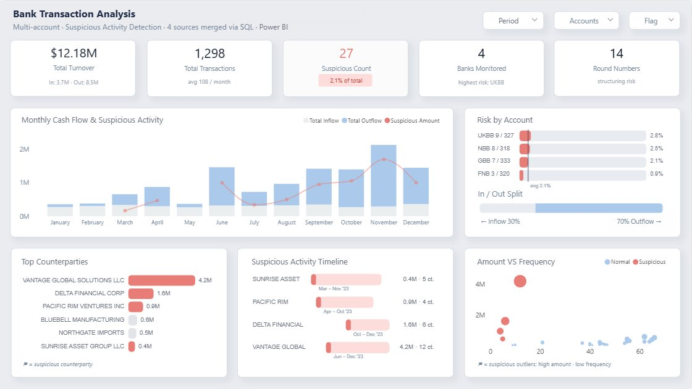

# Bank Transaction Analysis - Suspicious activity dashboard (Power BI)

A flexible **bank transaction monitoring dashboard** for suspicious activity detection across any number of accounts and sources.  
Connect your own merged statement file - the report adapts to any volume, period, and bank count, with counterparty risk scoring and round-number structuring alerts built in.

---

## Table of contents
- [Overview](#overview)
- [Who this is for](#who-this-is-for)
- [Key features](#key-features)
- [Dashboard sections](#dashboard-sections)
- [Data model (at a glance)](#data-model-at-a-glance)
- [Measures](#measures)
- [Suspicious activity logic](#suspicious-activity-logic)
- [Screenshots](#screenshots)
- [Project structure](#project-structure)
- [Getting started](#getting-started)
- [Data and privacy](#data-and-privacy)
- [Roadmap](#roadmap)
- [License](#license)
- [Contact](#contact)

---

## Overview
**Goal:** provide a clear, investigation-ready view of transaction activity across merged bank statements - with automated risk flagging per counterparty, account, and period.  
**Tech stack:** Power BI Desktop · DAX · Deneb (Vega-Lite JSON) · SQL (data merge) · Excel.

For the full Python → SQL Server → dbt pipeline behind this dashboard, see [forensic-bank-statement-review](https://github.com/IrinaTok11/forensic-bank-statement-review).

---

## Who this is for
Financial crime analysts; AML compliance officers; internal audit and risk teams; forensic accountants reviewing multi-account cash flows.

---

## Key features
- **KPI strip** - Total Turnover, Transaction Count, Suspicious Count, Banks Monitored, Round Numbers - all with inline context labels.
- **Risk by account** - ranked bar chart of suspicious rate per bank account with avg benchmark line.
- **Monthly cash flow** - inflow / outflow bars overlaid with suspicious amount trend line.
- **Counterparty risk** - top counterparties ranked by volume with suspicious flag highlights.
- **Suspicious activity timeline** - per-counterparty activity windows (start → end month, count, amount).
- **Amount vs Frequency scatter** - high-amount / low-frequency outlier detection.
- **In / Out split** - single-bar ratio showing 30% inflow · 70% outflow balance.
- **Slicers:** Period · Account · Flag.

---

## Dashboard sections

| Section | Visual type | Description |
|---|---|---|
| KPI strip | Card | 5 headline metrics with sub-labels |
| Monthly Cash Flow & Suspicious Activity | Clustered bar + line | Inflow, Outflow, Suspicious Amount by month |
| Risk by Account | Bar chart | Suspicious rate per account, avg reference line |
| In / Out Split | Single bar | Inflow vs Outflow ratio |
| Top Counterparties | Bar chart | Volume ranking, suspicious counterparties highlighted |
| Suspicious Activity Timeline | Gantt-style | Activity window per flagged counterparty |
| Amount VS Frequency | Scatter | Normal vs Suspicious transaction clusters |

---

## Data model (at a glance)
- **Tables:** `Sheet1` (fact: all transactions) · `FlagSummary` (aggregated risk flags) · `DateTableTemplate` (date spine).
- **Relationships:** `Sheet1[Date]` → date table (many-to-one).
- **Measures location:** all measures stored in `Sheet1`, versioned in [`/dax`](./dax).
- **Source flexibility:** swap `merged_statements_.xlsx` with any merged statement file - visuals and measures adapt automatically to the data volume and date range present.

---

## Measures

29 DAX measures grouped into four categories. Full source in [`dax/measures.dax`](./dax/measures.dax).

### Core aggregates
- `Total Transactions` · `Total Inflow` · `Total Outflow` · `Total Turnover` · `Net Cash Flow` · `Bank Count`

### Suspicious activity
- `Suspicious Count` · `Suspicious %` · `Suspicious Amount CP` · `Suspicious Amount Monthly`
- `Flagged Counterparties` · `Round Number Count`

### Counterparty
- `CounterpartyRisk` · `CounterpartyColor` · `CP Period` · `CP Start Month` · `CP End Month`

### Labels
- `Avg per Month Label` · `Inflow % Label` · `Outflow % Label` · `Suspicious Pct Label`
- `Inflow Outflow Label` · `Top Risk Bank` · `Risk Label` · `Total Transactions Label`

---

## Deneb visuals

Four custom Vega-Lite visuals built with [Deneb](https://deneb-viz.github.io/). Specs versioned in [`/deneb`](./deneb).

| File | Visual |
|---|---|
| `in_out_split.json` | Normalised stacked bar - inflow vs outflow ratio |
| `risk_by_account.json` | Ranked bars with avg risk reference line per account |
| `suspicious_activity_timeline.json` | Gantt-style activity window per flagged counterparty |
| `top_counterparties.json` | Volume ranking; suspicious counterparties in red |

---

## Suspicious activity logic

Transactions are flagged on three independent signals:

1. **`IsSuspicious` flag** - set at source; drives Suspicious Count, Suspicious %, and all timeline visuals.
2. **`IsRoundNumber` flag** - exact multiples of 100,000; structuring indicator (14 flagged, tagged as "structuring risk").
3. **Amount vs Frequency outliers** - scatter plot isolates high-amount / low-frequency counterparties visually; these appear as suspicious outliers in the bottom-right cluster.

---

## Screenshots

---

## Project structure
~~~text
bank-transaction-analysis
├─ data/
│  ├─ merged_statements_.xlsx          # bank sources merged via SQL
│  └─ README.md                        # column definitions
├─ dax/
│  ├─ measures.dax                     # all 29 measures, grouped and commented
│  └─ README.md                        # measure groups and DAX conventions
├─ deneb/
│  ├─ in_out_split.json                # inflow vs outflow ratio bar
│  ├─ risk_by_account.json             # ranked risk bars with avg line
│  ├─ suspicious_activity_timeline.json # Gantt per flagged counterparty
│  ├─ top_counterparties.json          # volume ranking bar chart
│  └─ README.md                        # field references, how to re-use
├─ theme/
│  ├─ BTA_Light.json                   # custom Power BI theme
│  └─ README.md                        # palette and how to apply
├─ assets/
│  └─ dashboard_cover.png              # dashboard screenshot
├─ bank-transaction-analysis.pbix
├─ LICENSE
└─ README.md
~~~

---

## Getting started

### Prerequisites
- Power BI Desktop (tested on Windows).

### Open the report
1. `git clone https://github.com/IrinaTok11/bank-transaction-analysis`
2. Open **bank-transaction-analysis.pbix** from the repo root.
3. If prompted, set the Excel path to `data/merged_statements_.xlsx`.
4. **Refresh** to recalculate all measures.

### Apply the theme
Power BI Desktop → **View → Themes → Browse for themes** → select `theme/BTA_Light.json`.

---

## Data and privacy
- Ships with **anonymised / sample** data (`data/`).
- Replace with real statements locally; keep raw account data and counterparty identifiers **out of version control**.

---

## Roadmap
- Network graph of counterparty relationships.
- Velocity alerts (transaction frequency spikes per account).
- Export: flagged transaction list as PDF evidence pack.
- Multi-year view with year-on-year suspicious rate trend.

---

## License
This project is available under the **MIT License**. See [LICENSE](LICENSE).

---

## Contact
**IRINA TOKMIANINA** - Financial / BI Analyst  
LinkedIn: [linkedin.com/in/tokmianina](https://www.linkedin.com/in/tokmianina/) · Email: irinatokmianina@gmail.com
